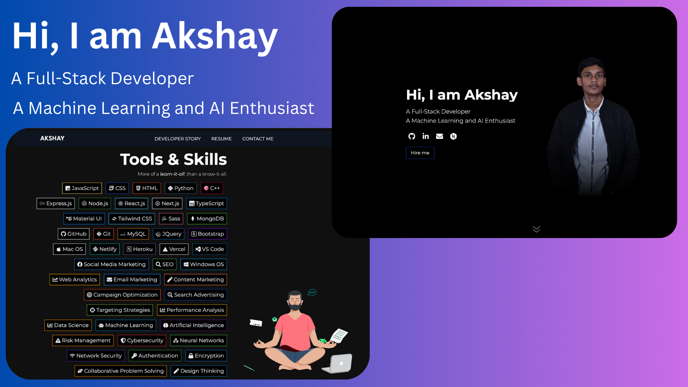

  
  
  

# Personal Portfolio Website  

A portfolio website to showcase my projects, skills, certifications, and achievements.  

## 👨‍💻 Tech Stack

- [Next.js](https://nextjs.org/)  
- [TypeScript](https://www.typescriptlang.org/)  
- [TailwindCSS](https://tailwindcss.com/)  
- [React Markdown](https://www.npmjs.com/package/react-markdown)  
- [Headless UI](https://headlessui.com/)  

## 💡 Features

### **Home Page**
- A sleek design featuring sections like hero, about, skills, projects, certifications, and contact.  
- Integrated working contact form with [Netlify Forms](https://www.netlify.com/platform/core/forms/), using email notifications.  
- [Lottie animations](https://lottiefiles.com/) used for efficient SVG rendering.  

### **Developer Story** [[View Here](https://connectwithakshay.netlify.app/story)]  
- Highlight achievements, certifications, education, and experience in a structured way.  
- Descriptions rendered using [React Markdown](https://www.npmjs.com/package/react-markdown).  
- Option to tag specific stories as “featured.”  

### **Other Features**
- Dynamic SEO for enhanced visibility on social platforms (Twitter, Facebook, Open Graph).  
- Custom 404 - Page Not Found.  
- Lazy image loading for optimized performance.  
- Hosted on [Netlify](https://www.netlify.com/).  

## 💻 Contributors  
  
